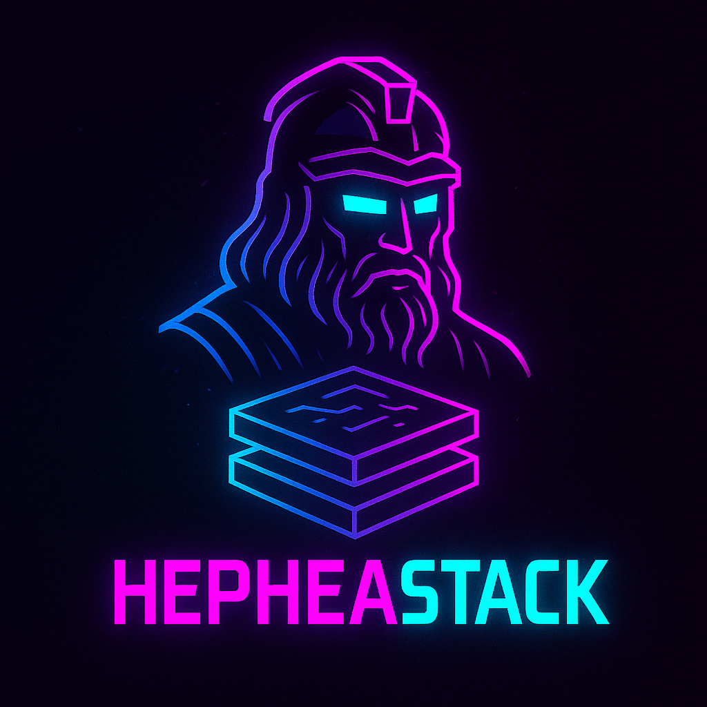

# 🚀 Terraform Platform

<div align="center">
    
</div>

A modern, interactive dashboard for visualizing and managing your Terraform infrastructure with advanced cost analysis and plan comparison features.


## ✨ Features

### 🏗️ Infrastructure Visualization
- **Interactive Resource Graph**: Visualize resource dependencies with D3.js
- **Multi-State Management**: Manage multiple Terraform state files
- **Resource Explorer**: Browse resources, modules, and providers
- **Real-time State Loading**: Load state files from GCP buckets

### 💰 FinOps & Cost Analysis
- **Cost Estimation**: Monthly and annual cost projections
- **Resource-level Costing**: Detailed cost breakdown per resource
- **GCP/GKE Pricing**: Specialized pricing for Google Cloud and Kubernetes
- **Cost Optimization**: Recommendations for reducing infrastructure costs
- **Plan Cost Impact**: See how planned changes affect your budget

### 📊 Plan Analysis
- **Plan Comparison**: Upload and analyze Terraform plan files
- **Resource Diff Viewer**: Side-by-side comparison of resource changes
- **Change Impact**: Understand what will be created, modified, or destroyed
- **Cost Impact Analysis**: See financial impact of planned changes

### 🎨 Modern UI/UX
- **Dark/Light Mode**: Beautiful themes for any preference
- **Responsive Design**: Works perfectly on desktop and mobile
- **Interactive Components**: Smooth animations and transitions
- **Professional Design**: Clean, modern interface built with shadcn/ui

## 🚀 Quick Start

### Prerequisites

- **Node.js** 18+ and npm
- **Docker** (optional, for containerized deployment)
- **Google Cloud Service Account** with Storage access
- **Terraform state files** stored in GCP buckets

### Local Development

1. **Clone the repository**

   ```bash
   git clone git@github.com:niv-devops/terraform-platform.git
   cd terraform-platform
   ```

2. **Install dependencies**

   ```bash
   npm install
   ```

3. **Set up environment variables**

   ```bash
   echo GOOGLE_KEY_PATH=/path/to/serviceaccount-key.json > .env # Edit .env with your configuration
   ```

4. **Start the development server**

   ```bash
   npm run dev
   ```

5. **Open your browser** and go to `http://localhost:3000`

### Docker Deployment

1. **Build the Docker image**

   ```bash
   docker build -t terraform-platform .
   ```

2. **Run the container**

   ```bash
   docker run -p 3000:3000 \
     -e GOOGLE_APPLICATION_CREDENTIALS=/app/service-account.json \
     -v /path/to/service-account.json:/app/service-account.json \
     terraform-platform
   ```

3. **Another option: Using Docker compose** to build and run container

   ```bash
   docker compose up -d # Make sure to have .env file in the same path
   ```

### Kubernetes Deployment

1. **Install with Helm**

   ```bash
   helm install terraform-platform ./helm/terraform-platform \
     --set env.NEXT_PUBLIC_GCP_BUCKET_NAME=your-bucket-name \
     --set env.NEXT_PUBLIC_TFSTATE_FILE_PATH=path/to/terraform.tfstate \
     --set secrets.gcpServiceAccountKey="$(cat /path/to/service-account-key.json | base64)"
   ```

## 🔧 Configuration

### Environment Variables

| Variable          | Description                     | Required | Example                     |
|-------------------|---------------------------------|----------|-----------------------------|
| `GOOGLE_KEY_PATH` | Path to GCP service account key | Yes      | `/app/service-account.json` |

### GCP Setup

1. **Create a service account**

   ```bash
   gcloud iam service-accounts create terraform-platform \
     --display-name="Terraform Platform"
   ```

2. **Grant Storage permissions**

   ```bash
   gcloud projects add-iam-policy-binding YOUR_PROJECT_ID \
     --member="serviceAccount:terraform-platform@YOUR_PROJECT_ID.iam.gserviceaccount.com" \
     --role="roles/storage.objectViewer"
   ```

3. **Create and download key**

   ```bash
   gcloud iam service-accounts keys create service-account-key.json \
     --iam-account=terraform-platform@YOUR_PROJECT_ID.iam.gserviceaccount.com
   ```

### Terraform Backend Configuration

Ensure your Terraform backend is configured to use GCS:

```hcl
terraform {
  backend "gcs" {
    bucket = "your-terraform-state-bucket"
    prefix = "environments/prod"
  }
}
